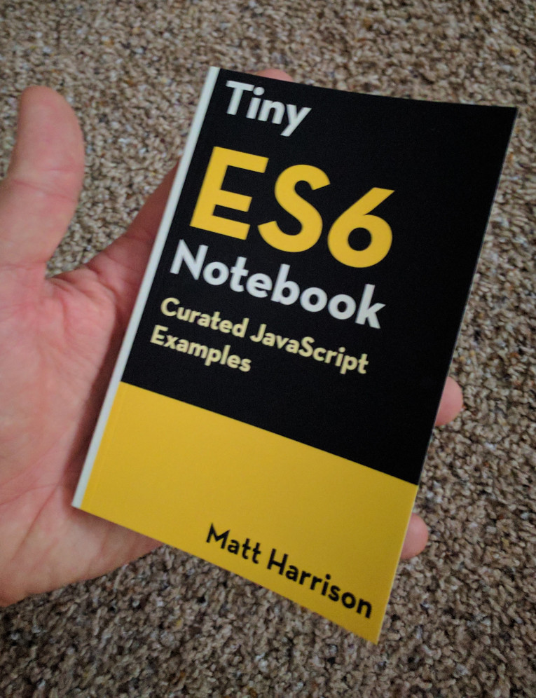

Tiny ES6 Notebook
========================

This repository contains the text for the *Tiny ES6 Notebook*.

Warning, this is not an introduction to JavaScript. Rather it is a notebook
containing curated examples for JavaScript as well as the new features
found in ES6. It is designed to accompany technical corporate
training offered by the author or aid those who want a quick refresher
to the JavaScript syntax.

Reviews
---------

Waiting for your tweets or comments

Bulk Purchase
---------------

If you are interested in purchasing larger amounts (100+) for schools, employees or for
use as giveaways/swag at a conference (much better than a tshirt!), get in touch 
with Matt (matt at metasnake dot com).

Thanks
------

If you enjoy this content, consider [purchasing the physical version](https://www.amazon.com/dp/B0742HCGBS/ref=sr_1_1?ie=UTF8&qid=1500525409&sr=8-1&keywords=tiny+javascript).
It is a hand laid out version that fits in the pocket and has blank
pages in the back for note taking. It is available at [Amazon](
https://www.amazon.com/dp/B0742HCGBS/ref=sr_1_1?ie=UTF8&qid=1500525409&sr=8-1&keywords=tiny+javascript). I'm
indebted to those who support my work and write reviews. Thanks!

Feel free to share this repository on social media.

Errors
------

The author is human and will certainly make errors. You may file a bug
and it may be resolved in a future version of the book. I love feedback
and would love to hear your ideas on what is missing or could be
improved.

Contents
--------

This book covers the syntax in JavaScript up to version ES6.

License
-------

This content is licensed under the
Attribution-NonCommercial-NoDerivatives 4.0 International (CC BY-NC-ND
4.0)

<https://creativecommons.org/licenses/by-nc-nd/4.0/>
